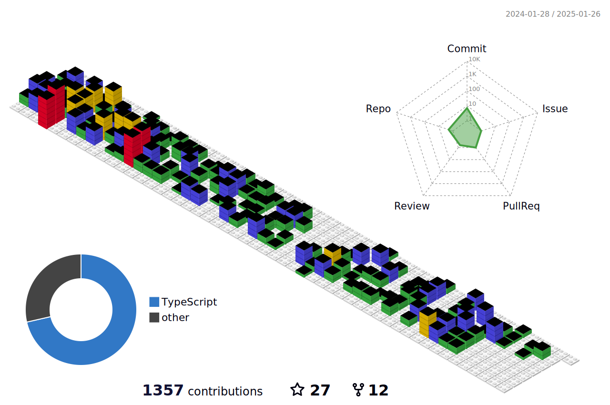

  
  <h2 align="center">Hi , I'm Wesley Maik</h2>
  

  
🇧🇷: Sou apaixonado por programação e desenvolvimento desde 2020. Minha especialização é Frontend e UI/UX Design mas possuo muita tech skill com backend. Amo criar e desenvolver produtos digitais que possam ser escaláveis e acessíveis para todo público, visando a melhor experiência tanto para a empresa quanto para o consumidor final. Eu prezo pelo impacto positivo dos meus projetos e amo agregar conhecimento em diversos ambientes fora da minha zona de conforto. Minhas principais skills são Javascript, Typescript, NodeJS, ReactJS, NextJS, Sass, PHP, Laravel, SQL, Python e entre outros.

  
  
🇺🇸: I've been passionate about programming and development since 2020. My specialization is Frontend and UI/UX Design but I have a lot of backend tech skills. I love to create and develop digital products that can be scalable and accessible to all audiences, aiming at the best experience for both the company and the end consumer. I value the positive impact of my projects and love to add knowledge in different environments outside my comfort zone.
  My main skills are Javascript, Typescript, NodeJS, ReactJS, NextJS, Sass, PHP, Laravel, SQL, Python and others.

  
  

    
    
    
    
    
    
    
    
    
    
    
  

  
  

  
  
  
  

  
  

  <h4>Technologies</h4>
  

  
  
  
  

  

   

   
   
   
   
  

