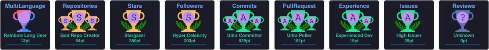

## 👋 Hi there, I'm Wesley Maik!

### 👨‍💻 Software Engineer focused on AI Engineering

I build **AI-powered applications, scalable web products, and developer experiences**, combining a strong Full Stack background with a growing focus on **LLMs, AI Agents, automation, and intelligent systems**.

* 🤖 Focused on **AI Engineering, Agentic AI, LLM applications, tool use, MCP, and AI automation**
* 💻 5+ years of professional experience building web applications and digital products
* ⚡ Strong background with **TypeScript, React, Next.js, Node.js, and cloud-native applications**
* 🧠 Interested in **AI systems, software architecture, distributed systems, and developer tooling**
* 🛒 Experience with **e-commerce, MarTech, SaaS, and high-traffic digital products**
* ✅ 1x VTEX IO Certified
* 🎓 Systems Analysis and Development degree, ongoing
* 🌎 Based in Campo Grande, Brazil

 

---

## 🧠 Current Focus

I'm currently deepening my experience in the intersection between **Software Engineering and Artificial Intelligence**, especially around:

* **AI Agents and Agentic Systems**
* **LLM-powered applications**
* **Tool calling and Model Context Protocol (MCP)**
* **AI automation and orchestration**
* **Context engineering, guardrails, and reliable AI workflows**
* **AI-assisted software development**
* **Scalable architectures for AI-enabled products**

My goal is to combine strong software engineering fundamentals with modern AI capabilities to build useful, reliable, and production-ready intelligent systems.

---

## 🛠️ Tech Stack

### 🤖 AI Engineering

### ⚙️ Software Engineering

### ☁️ Cloud & DevOps

### 🛒 Web, Commerce & Digital Experiences

<strong>Additional technologies I've worked with</strong>

 

---

## 📜 A Bit About My Journey

I started programming in **2018**, initially exploring web development as a hobby, and began my professional software engineering career in **2021**.

My background was built around web engineering, from maintaining PHP and JavaScript systems to developing modern applications with **React, Next.js, TypeScript, Node.js, and cloud services**.

Over the years, I've worked across **e-commerce, SaaS, MarTech, and digital product development**, building user-facing applications, backend services, integrations, and scalable architectures.

Today, I'm increasingly focused on **AI Engineering**, exploring how LLMs, agents, intelligent automation, and modern software architecture can be combined to create better products and developer experiences.

I still care deeply about good interfaces and product experience. For me, AI is not a replacement for solid software engineering, it is another powerful layer we can use to build better software.

---

## 🎯 What I'm Building Toward

* 🤖 Becoming a strong **AI Engineer**, with deep Software Engineering fundamentals
* 🧠 Building production-ready **AI Agents and LLM-powered applications**
* 🏗️ Deepening my knowledge of **software architecture and distributed systems**
* 🌍 Working on impactful products with international teams
* 🧑‍💻 Contributing more to **open source and the developer community**
* 🚀 Building products that connect **AI, software engineering, and great user experiences**

---

## 📊 GitHub Stats

  
  

### 🏆 GitHub Trophies

  

---

## 📫 Let's Connect

---

  Building software, exploring AI, and always learning something new.

